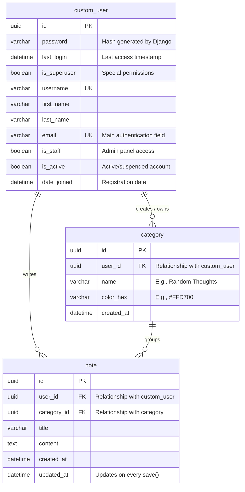

# Database Schema: Note-Taking Application

Based on the system requirements and the physical database structure after applying Django ORM migrations, here is the final relational schema. It uses three main entities: **custom_user** (User), **category** (Category), and **note** (Note).

## Entity-Relationship (ER) Diagram

## Table Descriptions

1. **custom_user (Users)**
   - Handles authentication and inherits Django's default fields (like `is_superuser`, `last_login`, etc.).
   - Stores the `password` as an encrypted hash rather than plain text for security.
   - The `email` field is set as unique and serves as the primary identifier for users to log in.

2. **category (Categories)**
   - Belongs to a specific user (`user_id`). This allows the system to automatically assign the default categories ("Random Thoughts", "School", "Personal") when a new account is created.
   - Each user has the ability to manage and assign colors (`color_hex`) to their own labels in isolation.

3. **note (Notes)**
   - Stores the text and title of the notes.
   - Contains foreign keys for both the category (`category_id`) and the author of the note (`user_id`).
   - The `updated_at` field will automatically update whenever the user edits the title, content, or changes the category, fulfilling the "last edited timestamp" requirement.
