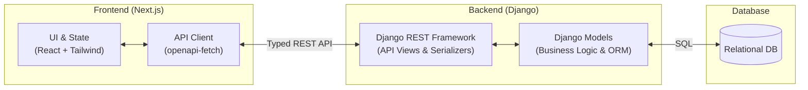

# Software Architecture: Note-Taking Application

This document outlines the software architecture for the Note-Taking Application, based on the provided user requirements and relational database schema. It is designed to serve as clear context for LLMs assisting in the development process.

## Technology Stack

*   **Frontend**: Next.js, React, Tailwind CSS
*   **Backend**: Python, Django, Django REST Framework (DRF)
*   **Database**: Relational Database (e.g., PostgreSQL or SQLite) managed via Django ORM

## Architecture Diagram

## Component Description and Data Flow

### 1. Frontend (Next.js + React + Tailwind CSS)
*   **UI Components & Pages**: Responsible for rendering the user interface according to the user journey, styled efficiently with Tailwind CSS.
    *   *Auth Screens*: Sign-up and login pages with a password visibility toggle.
    *   *Main Dashboard*: Displays the sidebar with categories (colors, titles, counts) and the grid of note preview cards (truncated content, specific date formatting).
    *   *Note Editor*: Interface to create and edit note titles, content, and category assignments. Category changes dynamically update the UI theme color.
*   **State Management**: Handles local client state, such as the currently active category filter ("All Categories" vs. a specific one), the loaded notes list, and the user's authentication status.
*   **Type-Safe API Client**: Uses `openapi-fetch` paired with auto-generated TypeScript types (`openapi-typescript`). This ensures end-to-end type safety, preventing runtime errors by enforcing the backend's contract on the frontend. It manages HTTP requests and attaches authentication credentials (e.g., JWT tokens or session cookies) to secure endpoints.

### 2. Backend (Django + Django REST Framework)
*   **DRF Routers / URLs**: The entry points for frontend API calls. They direct incoming HTTP requests (GET, POST, PUT, DELETE) to the appropriate API Views.
*   **API Views / ViewSets**: Contain the core business logic of the application.
    *   *Auth Logic*: Handles user registration, password hashing (relying on Django's built-in auth mechanism), and login verification. When a new user registers, it intercepts the creation process to automatically generate the default categories ("Random Thoughts", "School", "Personal").
    *   *Notes & Categories Logic*: Handles CRUD operations. It automatically assigns the `user_id` based on the authenticated request, ensuring multi-tenant data isolation (users can only see their own notes and categories).
*   **DRF Serializers**: Validates incoming JSON data from the frontend and serializes Django Model instances back into JSON. It handles read-only fields and relational mapping.
*   **Django Models**: Python classes representing the database schema (`custom_user`, `category`, `note`). The ORM simplifies database interactions, automatically handling timestamps like the `updated_at` requirement on every `save()` operation.
*   **OpenAPI Schema Generator**: Tools like `drf-spectacular` inspect the Views and Serializers to automatically generate an OpenAPI (Swagger) schema. This schema serves as the single source of truth for the API contract, which is then consumed by the frontend to generate TypeScript types.

### 3. Data Persistence (Database)
*   A relational database storing the three main entities defined in the ER model. It enforces foreign key constraints (e.g., a note must belong to a user and a category) and unique constraints (e.g., unique email addresses for login), handled entirely via Django ORM migrations.
