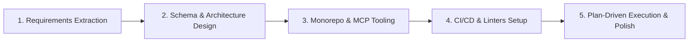
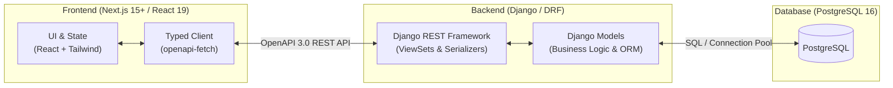
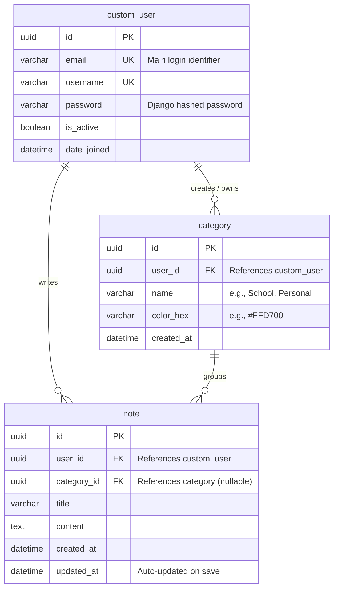

# Aesthetic Notes App - Turbo AI Senior Full Stack Challenge

A production-ready, modular monorepo note-taking application built with **Django REST Framework** (Backend) and **Next.js 15+ / React 19** (Frontend). Designed with a focus on clean architecture, security, performance, and an agentic AI-driven development workflow.

---

## 1. Quick Start & Environment Setup

The entire stack is containerized with Docker Compose for a seamless one-command setup.

### Prerequisites
- [Docker](https://docs.docker.com/get-docker/) & [Docker Compose](https://docs.docker.com/compose/install/)

### Step-by-Step Initial Setup

Follow these steps to have the entire full-stack application running with database schema and optional seed data:

#### 1. Clone & Configure Environment
```bash
# Clone the repository
git clone <your-repo-url>
cd note_app_monorepo

# Create environment configuration from example template
cp .env.example .env
```

#### 2. Start Services with Docker Compose
```bash
# Build and start all containers in the background (PostgreSQL, Django, Next.js)
docker compose up --build -d
```

#### 3. Apply Database Migrations (Required)
```bash
# Initialize PostgreSQL schema tables
docker compose exec backend python manage.py migrate
```

#### 4. Seed Sample Data & Create Admin (Optional)
```bash
# Populate database with realistic sample notes & categories
docker compose exec backend python manage.py seed_notes

# Create an administrator account for Django Admin
docker compose exec backend python manage.py createsuperuser
```

---

###  Access Points & URLs
| Service | URL | Description |
| :--- | :--- | :--- |
| **Frontend App** | [http://localhost:3000](http://localhost:3000) | Next.js interactive web client |
| **Backend API** | [http://localhost:8000/api/](http://localhost:8000/api/) | Django REST Framework API root |
| **Swagger UI** | [http://localhost:8000/api/schema/swagger-ui/](http://localhost:8000/api/schema/swagger-ui/) | Interactive OpenAPI 3.0 documentation |
| **ReDoc UI** | [http://localhost:8000/api/schema/redoc/](http://localhost:8000/api/schema/redoc/) | Alternative API specification viewer |
| **Django Admin** | [http://localhost:8000/admin/](http://localhost:8000/admin/) | Database administration panel |

---

### 🧪 Running Tests & Code Coverage

You can run test suites and coverage reports directly through Docker without installing local dependencies:

#### 1. Backend Test Suite & Coverage (Pytest)
```bash
docker compose exec backend pytest --cov=. --cov-report=term-missing
```

#### 2. Frontend Test Suite & Coverage (Vitest)
```bash
# Run inside Docker container (recommended):
docker compose exec frontend npm run test:coverage

# Or run locally on host machine:
cd frontend && npm install && npm run test:coverage
```

#### 3. Code Quality & Linting Checks
```bash
# Backend (Ruff)
docker compose exec backend ruff check .
docker compose exec backend ruff format --check .

# Frontend (ESLint & Prettier)
docker compose exec frontend npm run lint
docker compose exec frontend npx prettier --check .
```

---

## 2. Project Architecture & Monorepo Structure

```text
note_app_monorepo/
├── .agents/                    # AI Rules, MCP configs, Architecture contracts & Skills
│   ├── rules/                  # Global AI rules (product_requirements, db_schema, etc.)
│   ├── skills/                 # Custom skills for automated DRF endpoint generation
│   └── mcp_config.json         # MCP server definitions (Postgres, Figma, Brave Search)
├── .github/
│   └── workflows/
│       └── ci.yml              # GitHub Actions CI (Ruff, ESLint, Prettier validation)
├── backend/                    # Django Modular Monolith
│   ├── core/                   # Project settings, WSGI/ASGI, global routing
│   ├── users/                  # Custom User domain (Auth, CustomUser model)
│   ├── notes/                  # Notes & Categories domain (Models, Serializers, Views, Signals)
│   ├── Dockerfile              # Lightweight Python 3.12-slim image powered by uv
│   └── pyproject.toml          # uv dependency manifest
├── frontend/                   # Next.js App Router (React 19, Tailwind CSS)
│   ├── src/
│   │   ├── app/                # App Router (Pages, Layouts, Server Actions)
│   │   ├── components/         # Reusable UI components (NoteCard, Sidebar, Editor)
│   │   └── lib/                # API clients, helpers, date formatters
│   ├── .husky/                 # Pre-commit git hooks
│   └── package.json            # Node.js dependencies and scripts
└── docker-compose.yml          # Service orchestration (PostgreSQL 16, Backend, Frontend)
```

---

## 3. Key Design & Technical Decisions

Here are the main technical decisions I made while building this application and why they matter:

### 1. PostgreSQL instead of MongoDB
- **Data Integrity:** The relationships in this app are clearly relational (`Users -> Categories -> Notes`). PostgreSQL handles foreign keys natively. For instance, if a category is removed, notes are preserved safely thanks to `ON DELETE SET NULL`.
- **Predictable Structure:** In MongoDB, embedding notes inside users or categories can lead to document size issues as notes grow. PostgreSQL keeps data normalized, fast, and easy to query.

### 2. Security: Native UUIDs
- Using incremental IDs (like `/api/notes/1/`) in REST APIs makes endpoints predictable and open to scraping or enumeration (IDOR) attacks.
- I used native **UUIDv4** across all models (`models.UUIDField`), making every URL unique and secure by default.

### 3. API Contract with Swagger & OpenAPI
- I integrated `drf-spectacular` to automatically generate **OpenAPI 3.0** documentation.
- This creates a single source of truth between the Django backend and Next.js frontend, preventing broken endpoints and missing fields.

### 4. Frontend & User Experience
- **Server vs Client Components:** Next.js Server Components handle initial page layout and data fetching, while Client Components are used only where user interactivity is needed (editing notes, category filters, and sidebar).
- **Debounced Auto-Save:** Notes auto-save as the user types without overloading the backend with an API request on every keystroke.
- **Button States & Spam Prevention:** Key action buttons include disabled and loading states to avoid accidental double submissions and race conditions.

### 5. Developer Tooling & Code Quality
- **`uv`:** Replaced standard pip with `uv` for much faster Python package management.
- **Pre-commit Hooks:** Set up `Husky` and `lint-staged` with `Prettier` (with automatic Tailwind class sorting) and `Ruff` for Python to format code before every commit.
- **GitHub Actions CI:** Added a workflow that checks code formatting and linting on every Pull Request.

---

## 4. AI-Driven Engineering Process (Chronological Workflow)

Rather than using AI just for code autocomplete, I leveraged an **agentic pair-programming workflow** following a clear, step-by-step engineering lifecycle:



1. **Phase 1 — Context & Requirements Extraction:** Extracted all product rules directly from the demo video and saved them in `.agents/rules/product_requirements.md`. This ensured the AI autonomously remembered business rules (like auto-generating the 3 default categories on signup via Django Signals).
2. **Phase 2 — Database & Architecture Design:** Drafted and approved the relational database schema and architecture diagrams with the AI before writing code.
3. **Phase 3 — Monorepo & MCP Setup:** Dockerized the full-stack setup and configured MCP tools (including Figma MCP to inspect design tokens directly from the URL).
4. **Phase 4 — CI/CD & Standards:** Configured Husky, Prettier, Ruff, and GitHub Actions to enforce production-level quality standards.
5. **Phase 5 — Plan Execution & UI Polish:** Followed structured implementation plans to build the endpoints, debouncing logic, category color synchronization, and responsive design.

>  **Multi-Model Strategy Note:** For optimal planning, I created initial architectural and implementation plans using **Gemini 3.1 Pro**, and then had **Claude** analyze, critique, and improve them. This cross-model reasoning approach caught edge cases early and produced significantly higher-quality execution plans.

---

## 5. Opportunities for Improvement & Known Limitations

To deliver a reliable MVP within the challenge timeframe, I prioritized core functionality, architecture, and user flow. Here are the main improvements I would implement next:

- **Stronger Password Validation:** Currently, registration accepts basic passwords. I would add stricter validation rules (minimum 8 characters, numbers, and special characters) on both the frontend form and backend serializers.
- **Pagination & Infinite Scroll:** For users with hundreds of notes, adding pagination or cursor-based infinite scrolling would improve load times and database performance.
- **Rich-Text / Markdown Editor:** Adding support for Markdown or a rich-text toolbar would give users more options to style their notes.
- **Delete Confirmation Dialogs:** Adding a confirmation modal before deleting a note or category to prevent accidental data loss.
- **Soft Deletes:** Adding a `deleted_at` field to let users recover accidentally deleted notes from a "Trash" folder.

---

## 6. System Diagrams

### High-Level Architecture Diagram


### Entity-Relationship (ER) Diagram


---

*Thank you for reviewing my submission! I look forward to discussing the architecture, implementation choices, and AI workflow in detail.*
