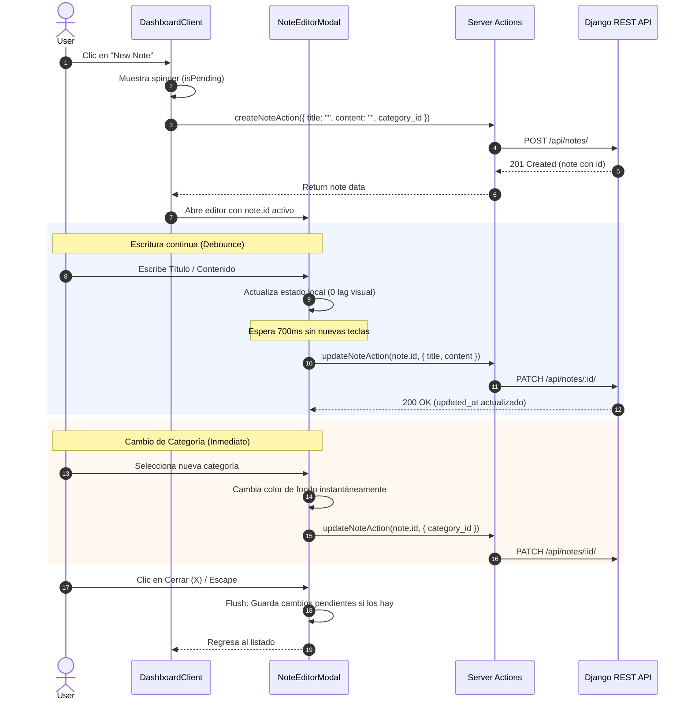

# Immediate Note Creation & Debounced Auto-Save Implementation Plan

This document details the real-time auto-saving workflow for notes without needing a manual "Save" button, matching modern note apps (Notion, Google Keep, Apple Notes).

## Architecture Overview

## Solved Edge Cases

### The "Erased Text" Bug on Revalidate
**Symptom**: Typing quickly and waiting for the debounce to trigger the auto-save would successfully save the data to the backend. However, immediately after the save finished, the locally typed text would instantly revert to whatever it was before the user started typing.
**Root Cause**:
1. When `updateNoteAction` finishes successfully, Next.js calls `revalidatePath("/")`.
2. The server re-fetches the page data, including a new `categories` array reference, and passes it to `DashboardClient`, which passes it to `NoteEditorModal`.
3. The `useEffect` inside `NoteEditorModal` responsible for initializing the local state (`setTitle`, `setContent`) had `categories` in its dependency array.
4. Because the `categories` array reference changed, the `useEffect` ran again.
5. It overwrote the input fields with `note.title` and `note.content`. Since `activeNote` in `DashboardClient` hadn't been updated locally with the new text, `note` still contained the old values, thus erasing the user's latest input.
**Fix**: Removed `categories` from the `useEffect` dependency array, as it was not being used inside the effect anyway. This ensures the component only initializes when the `note` ID actually changes or the modal opens, allowing background saves to happen without disrupting local React state.

## Implementation Details

### Backend
1. **`models.py`**: `title` field modified to have `blank=True, default=""` to allow creating empty notes initially.
2. **`serializers.py`**: `NoteSerializer` updated with `title = serializers.CharField(allow_blank=True, required=False, default="")`.

### Frontend
1. **`notes.ts`**: TypeScript types for `title` changed to optional (`title?: string`) to support partial updates (`PATCH`).
2. **`DashboardClient.tsx`**: "New Note" button triggers an immediate `createNoteAction` with a loading state (`isPending`), and then opens the `NoteEditorModal` directly with the newly created note's ID.
3. **`NoteEditorModal.tsx`**:
    - **Debounce Timer**: A `useRef` stores the `setTimeout` of 700ms. On every keystroke, the timer is cleared and restarted.
    - **Instant Save**: Changing a category immediately triggers the `flushSave()` function.
    - **Flush on Close**: If the user closes the modal while a debounce timer is active (or there are unsaved changes), `flushSave()` is called synchronously as a fire-and-forget request before unmounting.
    - **UI Indicators**: Displays `"Saving..."` and `"Last Edited: [Date]"` based on the `isSaving` state, removing the need for a manual "Save" button.
